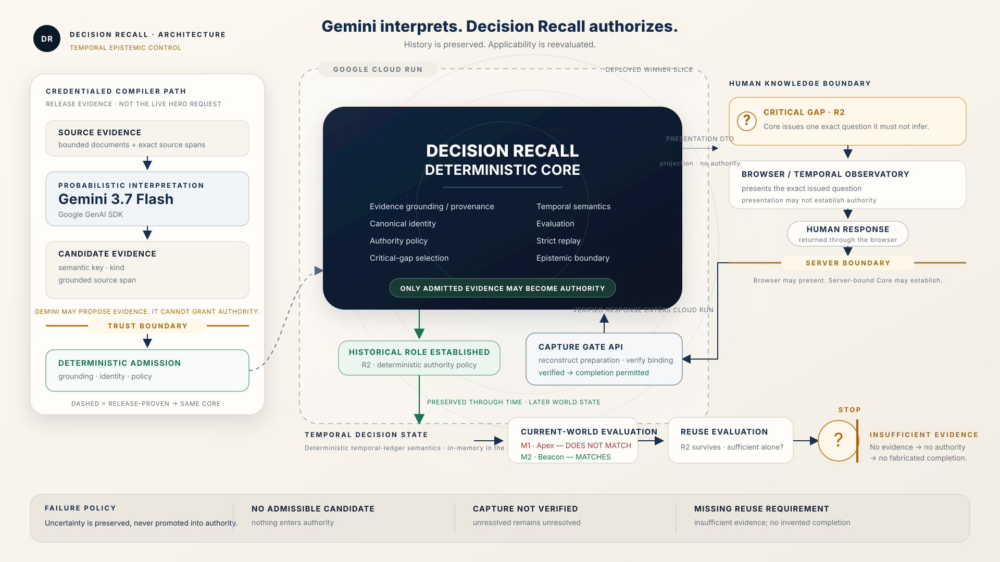

# Decision Recall

**A temporal epistemic control layer that preserves why a decision was made, reevaluates what still applies, and refuses to invent missing authority.**

## Live Demo

[Launch Decision Recall on Google Cloud Run](https://decision-recall-296984548706.us-central1.run.app)

**Public judge demo · no login required**

This is the deployed judge-facing winner slice for the `D-104` supplier-resilience decision. The live hero interaction uses the deterministic Decision Recall runtime and server-bound Capture Gate; clicking **YES** does not call Gemini.

## What Decision Recall Does

Decision Recall begins with a recorded six-month keep-both decision involving Apex and Beacon. Source evidence may be interpreted probabilistically, but the deterministic core identifies a critical historical relation—whether Beacon's restart delay materially influenced `D-104`—that it cannot legitimately infer.

The system asks one exact clarification question. Cloud Run reconstructs the authoritative capture preparation and verifies the human response binding before the deterministic authority path may establish `R2`. Later changes in Apex and Beacon are evaluated separately from that preserved historical role. When reuse requires another relation that was never established, Decision Recall stops with **insufficient evidence**.

## Why It Is Different

> **Gemini interprets. Decision Recall authorizes.**
>
> **History is preserved. Applicability is reevaluated.**

Human feedback does not merely change the conversation; it changes the authorized decision state used by later deterministic evaluation. The deployed golden slice keeps probabilistic interpretation, human response verification, historical authority, and current-world applicability as separate claims.

## Google Stack

- **Google Agent Framework used: Google GenAI SDK** (`google-genai` 2.14.0).
- **Gemini 3.7 Flash** produces bounded candidate evidence in the credentialed, release-proven compiler path. It does not authorize state and is not called by the live **YES** interaction.
- **Google Cloud Run** hosts the React winner slice, Capture Gate API, and deterministic Decision Recall runtime.
- **Google Cloud Build** builds the committed `Dockerfile.cloudrun` image.
- **Artifact Registry** stores the Cloud Build image at `us-central1-docker.pkg.dev/<PROJECT_ID>/decision-recall/winner-slice:latest`.
- **React + Motion + SVG/CSS** provide the Temporal Observatory presentation; they project engine truth and do not compute authority.

## Architecture



The release-proven Gemini compiler path and the live Cloud Run judge path converge independently into one deterministic core. Gemini may propose grounded candidates; the browser may present and return a human answer; neither may grant authority. The Capture Gate verifies binding, while the deterministic core controls historical establishment, temporal evaluation, replay, and the final epistemic stop.

## Live Proof / Trust Boundaries

1. Gemini can propose bounded candidate evidence but cannot grant authority.
2. A browser or human response cannot establish history by itself.
3. The Cloud Run Capture Gate reconstructs authoritative preparation and verifies the response binding.
4. Only the deterministic authority path may establish the historical relation.
5. Missing reuse evidence remains missing; no completion is fabricated.

The committed release manifest at [`artifacts/pc2-credentialed-release-evidence.json`](artifacts/pc2-credentialed-release-evidence.json) identifies the credentialed PC2 evidence by SHA-256. The raw credentialed probe artifact is not committed.

## Collaborative Partner

Decision Recall is submitted as a **Collaborative Partner**. It interprets messy evidence, identifies a critical missing relation, asks a precise clarification question, incorporates the verified human response into structured authorized state, reevaluates when the world changes, and refuses to fabricate the next missing relation.

Human feedback does not merely produce chat text. It changes the authorized decision state used by later evaluation.

## Current Submission State

- Deterministic core: frozen
- Gemini compiler boundary: frozen with credentialed release evidence
- Capture Gate: live on Cloud Run
- Judge-facing winner slice: deployed in English
- Why / Proof: frozen
- Architecture: frozen
- Target category: Collaborative Partner

## Run Locally

Requirements:

- Python 3.11 or newer (`pyproject.toml` requires `>=3.11`)
- Node.js 24 and npm (matching the committed Cloud Run build image)

From the repository root in PowerShell:

```powershell
python -m venv .venv
.\.venv\Scripts\Activate.ps1
python -m pip install -e .

Set-Location apps/decision-threads
npm install --no-audit --no-fund
npm run build
Set-Location ../..

python -m decision_recall.product.cloudrun_server
```

Open [http://localhost:8080](http://localhost:8080). Verify the server in another terminal:

```powershell
Invoke-RestMethod http://localhost:8080/health
Invoke-RestMethod http://localhost:8080/api/capture-preparation
```

`npm run build` first generates the deterministic fallback at `apps/decision-threads/public/demo-state.json`, then creates the frontend build in `apps/decision-threads/dist`. The server defaults to port `8080` and serves that directory. No environment variable or Gemini credential is required for the local judge-facing winner slice because the hero path is deterministic.

Docker provides the closest local equivalent to the deployed container:

```powershell
docker build -f Dockerfile.cloudrun -t decision-recall:local .
docker run --rm -p 8080:8080 decision-recall:local
```

## Deploy to Google Cloud

These commands map directly to `cloudbuild.cloudrun.yaml`, `Dockerfile.cloudrun`, and the runtime's port `8080`. They require your own Google Cloud credentials and a project with billing enabled.

Authenticate, select the project, and enable the services used by this repository:

```powershell
gcloud auth login
gcloud config set project <PROJECT_ID>
gcloud services enable run.googleapis.com cloudbuild.googleapis.com artifactregistry.googleapis.com
```

Create the Artifact Registry repository once if it does not already exist:

```powershell
gcloud artifacts repositories create decision-recall `
  --repository-format=docker `
  --location=us-central1 `
  --description="Decision Recall images"
```

Build and publish the image using the committed Cloud Build configuration:

```powershell
gcloud builds submit --config cloudbuild.cloudrun.yaml .
```

The configuration publishes:

```text
us-central1-docker.pkg.dev/<PROJECT_ID>/decision-recall/winner-slice:latest
```

Deploy that image:

```powershell
gcloud run deploy decision-recall `
  --image us-central1-docker.pkg.dev/<PROJECT_ID>/decision-recall/winner-slice:latest `
  --region us-central1 `
  --platform managed `
  --allow-unauthenticated `
  --port 8080
```

Verify the deployed service:

```powershell
$URL = gcloud run services describe decision-recall `
  --region us-central1 `
  --format='value(status.url)'

Invoke-RestMethod "$URL/health"
Invoke-RestMethod "$URL/api/capture-preparation"
```

Repository structure and command/configuration mapping are verified locally. Cloud Build and deployment require user cloud credentials and were not rerun for this documentation change. See [`docs/CLOUD_RUN_DEPLOYMENT.md`](docs/CLOUD_RUN_DEPLOYMENT.md) for operational detail.

## Tests and Evidence

Install the declared Python dependencies first, then run the deterministic Decision Recall tests:

```powershell
python -m unittest discover -s tests -p "test_decision_recall_*.py" -v
```

Run the focused frontend Proof regression and production build:

```powershell
Set-Location apps/decision-threads
node --test test/*.test.mjs
npm run build
```

Gemini credentialed behavior is release evidence, not a hidden live dependency of the hero. The committed PC2 manifest records the model, bounded semantic gate, and SHA-256 identity of the preserved raw evidence without committing credentials or the raw probe artifact.

## Scope and Limitations

- The submission demonstrates one deployed golden slice, not broad cross-domain superiority.
- The deployed golden slice uses in-memory temporal state; it does not claim restart-persistent Cloud storage.
- Enterprise-scale performance and broad RAG or recovery superiority are not claimed.
- The live **YES** interaction does not call Gemini. Gemini evidence is release-proven separately from the live Capture Gate interaction.

## Hackathon Build Scope

Repository history begins on August 15, 2026, within the recorded August 3–31, 2026 submission period. It shows DR-Bench first committed on August 15, the submitted Decision Recall deterministic core beginning August 23, and the engine-bound winner slice and Cloud Run runtime added August 24–25. No tracked project material or incorporated pre-existing code is identifiable before the submission period.

DR-Bench, mechanism experiments, and earlier prototypes are supporting research assets, not the current judge-facing submission. They were also introduced in this repository during the submission period. If material from outside this repository was incorporated and is not represented by this history, it must be disclosed separately; the repository alone cannot establish untracked provenance.

## Research History

The repository preserves the research path that led to the current winner slice. These assets are historical/supporting evidence, not the active judge experience:

- **DR-Bench v0.1** is a mechanism-agnostic benchmark for Material Decision Dependence, selective reevaluation, and minimum-disruption recovery. Its frozen dataset contains 12 development and 4 sealed-holdout scenarios. See [`docs/SCHEMA.md`](docs/SCHEMA.md).
- **VWS-0.5** failed its comprehension gate and is preserved at `prototypes/vws-05/`.
- **VWS-0.6** tested a simplified bilingual narrative and is preserved at `prototypes/vws-06/`; it is not the current deployed winner slice.
- Round B, reference-decomposition, and premise-capture protocols remain under [`docs/`](docs/) as scientific audit history.
- Milestone and temporal-ledger design evidence remains in [`docs/temporal-authority-ledger.md`](docs/temporal-authority-ledger.md) and the deterministic test suite.

DR-Bench commands remain available for research use after installing the project:

```powershell
python -m dr_bench list
python -m dr_bench show dev-001 --phase discovery --condition implicit
python -m dr_bench show dev-001 --phase discovery --condition structured
python -m dr_bench show dev-001 --phase recovery
```
