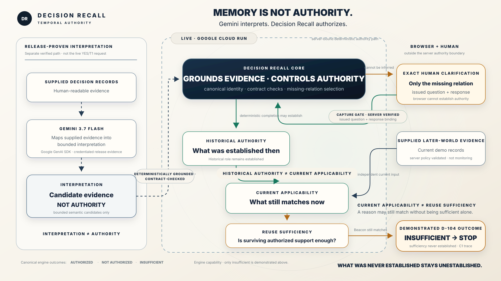

# Decision Recall

## **Memory is not authority.**

AI systems may remember records and decisions, but recalled evidence does not by itself establish **why a decision was made**, **what still applies now**, or **whether the surviving rationale is sufficient for reuse**.

Decision Recall preserves those boundaries.

> **Gemini interprets. Decision Recall authorizes.**

### [Launch the live Decision Recall demo on Google Cloud Run](https://decision-recall-296984548706.us-central1.run.app)

**Public judge demo · no login required**

The deployed demonstration follows one supplier-resilience decision, `D-104`. Its live interaction runs through a deterministic Decision Recall runtime and server-bound Capture Gate on Cloud Run. The live **YES** action does not call Gemini.

## The Operational Problem

Given the available decision records, Decision Recall separates known facts from authorized rationale, identifies the unresolved required relation under the assigned profile, requests the missing human authority, and reevaluates later evidence without rewriting history.

Without that authority structure, later decision reuse can require manually reconstructing:

- what was known;
- what actually influenced the decision;
- what was never established;
- what changed later; and
- whether the surviving rationale is sufficient for reuse.

## How the Deployed D-104 Demonstration Works

```text
AVAILABLE RECORDS
       ↓
BOUNDED INTERPRETATION
       ↓
KNOWN FACT ≠ ESTABLISHED RATIONALE
       ↓
ONE REQUIRED HISTORICAL RELATION REMAINS UNRESOLVED
       ↓
EXACT CLARIFICATION → SERVER-BOUND HUMAN AUTHORITY
       ↓
HISTORICAL RELATION ESTABLISHED
       ↓
LATER-WORLD EVIDENCE CHANGES → APPLICABILITY REEVALUATED
       ↓
REUSE SUFFICIENCY WAS NEVER ESTABLISHED → STOP
```

Gemini interprets human-readable decision records into bounded candidates. Decision Recall grounds those candidates, controls identity and authority, detects the relation the evidence cannot establish, and asks the human only for that missing authority. After verified capture, historical rationale remains recorded while current applicability is evaluated separately.

## More Than Retrieval or Memory

| Retrieval / memory | Decision Recall additionally models |
|---|---|
| Makes relevant prior evidence available | Canonical decision identity and source provenance |
| Recalls prior records or context | What the evidence is authorized to establish |
| Supplies evidence for a current task | Historical rationale versus current applicability |
| May expose missing context | Explicit missing relations and reuse sufficiency |
| — | Deterministic replay and an explicit epistemic STOP |

**RAG retrieves relevant evidence. Decision Recall additionally models what that evidence is authorized to establish, when that authority was established, what still applies, and what remains unknown.** Decision Recall complements retrieval; it does not claim to replace it.

## Collaborative Partner

Decision Recall leads until a relation requires human authority; verified feedback changes structured decision state rather than merely adding chat text.

- **Leads:** processes supplied evidence, identifies the unresolved required relation, and issues the clarification.
- **Captures human authority:** server-binds the declaration to the issued capture session, gap, and exact question.
- **Mutates structured authorized state:** verified feedback changes the historical relation from unresolved to established.
- **Adapts:** later evidence changes current applicability without rewriting historical authority; missing reuse sufficiency still causes STOP.

## Google Stack

- **Google Agent Framework used: Google GenAI SDK** (`google-genai` 2.14.0).
- **Gemini 3.7 Flash** produces bounded candidate evidence in a credentialed, release-proven compiler path. It does not authorize state and is not called by the live **YES** interaction.
- **Google Cloud Run** serves the built React frontend assets and hosts the Capture Gate API and deterministic Decision Recall runtime.
- **Google Cloud Build** builds the committed `Dockerfile.cloudrun` image.
- **Artifact Registry** stores the Cloud Build image at `us-central1-docker.pkg.dev/<PROJECT_ID>/decision-recall/winner-slice:latest`.
- **React + Motion + SVG/CSS** provide the Temporal Observatory presentation; they project engine truth and do not compute authority.

## Judge-Facing Architecture



The release-evidence lane and live Cloud Run lane belong to the same D-104 decision case, but they are not one runtime request. Release-proven Gemini interpretation supplies bounded candidates to deterministic admission. Independently, the live Capture Gate reconstructs and verifies the issued human capture. Both meet at the same Decision Recall authority core; neither Gemini nor the browser grants authority directly.

[Inspect the detailed technical architecture](docs/architecture/decision-recall-architecture.svg).

## Evidence

### Live Cloud Run Proof of Action

The public `.run.app` demonstration shows this live path:

```text
POST /api/capture
→ server reconstructs the authoritative issued preparation
→ verifies capture session + gap + question binding
→ permits deterministic completion only after verification
→ historical relation becomes established
```

The browser returns a declaration; it does not write authoritative history. Cloud Run hosts the Capture Gate and deterministic runtime that enforce that boundary.

### Credentialed Gemini Release Evidence

There are **9 credentialed executions across 3 predefined D-104 semantic cases**:

- normal ×3;
- paraphrase ×3; and
- document prompt injection ×3.

All matched the frozen semantic oracle: **semantic key + kind + source identity + exact quote hash**.

This is release evidence for three predefined cases, **not a general robustness benchmark**. Gemini produced bounded candidates for the Apex historical role and the Beacon restart-delay fact; it did not discover or authorize the missing Beacon historical-influence relation. Gemini is not called by the live **YES** action.

The raw credentialed artifact remains local and untracked. The committed [release manifest](artifacts/pc2-credentialed-release-evidence.json) preserves its SHA-256 identity, and the committed [judge-safe projection](apps/decision-threads/src/pc2-judge-safe-gemini-projection.json) exposes only the allowlisted evidence used by the winner presentation.

## Generalization Truth

| Level | What exists |
|---|---|
| **Deployed** | One end-to-end D-104 supplier-resilience profile. |
| **Reusable mechanisms** | Exact-span grounding, semantic resolution, profile binding, gap selection, structured capture, authority policy, temporal ledger, and strict replay. |
| **Research lineage** | DR-Bench contains 12 development scenarios and 4 design-holdout scenarios for separate mechanism research and evaluation. |

DR-Bench is a separate research/evaluation harness. It does **not** constitute 16 end-to-end Decision Recall deployments or validations.

## Scope and Limitations

- The submission demonstrates one deployed D-104 golden case, not broad cross-domain superiority.
- The deployed demonstration uses in-memory temporal state; it does not claim restart-persistent Cloud decision memory.
- Gemini release evidence is separate from the live Capture Gate interaction; the live **YES** action does not call Gemini.
- Enterprise-scale performance, autonomous external monitoring, and broad RAG or recovery superiority are not claimed.

## Run Locally

Requirements:

- Python 3.11 or newer (`pyproject.toml` requires `>=3.11`)
- Node.js 24 and npm (matching the committed Cloud Run build image)

From the repository root in PowerShell:

```powershell
python -m venv .venv
.\.venv\Scripts\Activate.ps1
python -m pip install -e .

Set-Location apps/decision-threads
npm ci --no-audit --no-fund
npm run build
Set-Location ../..

python -m decision_recall.product.cloudrun_server
```

Open [http://localhost:8080](http://localhost:8080). Verify the server in another terminal:

```powershell
Invoke-RestMethod http://localhost:8080/health
Invoke-RestMethod http://localhost:8080/api/capture-preparation
```

The committed npm lockfile pins the frontend dependency graph. `npm run build` generates the deterministic fallback at `apps/decision-threads/public/demo-state.json`, then builds the frontend into `apps/decision-threads/dist`. The server defaults to port `8080` and serves that directory. No Gemini credential is required for the local judge demonstration because its hero path is deterministic.

Docker provides the closest local equivalent to the deployed container:

```powershell
docker build -f Dockerfile.cloudrun -t decision-recall:local .
docker run --rm -p 8080:8080 decision-recall:local
```

## Deploy to Google Cloud

These commands map to `cloudbuild.cloudrun.yaml`, `Dockerfile.cloudrun`, and runtime port `8080`. They require your own Google Cloud credentials and a project with billing enabled.

```powershell
gcloud auth login
gcloud config set project <PROJECT_ID>
gcloud services enable run.googleapis.com cloudbuild.googleapis.com artifactregistry.googleapis.com

gcloud artifacts repositories create decision-recall `
  --repository-format=docker `
  --location=us-central1 `
  --description="Decision Recall images"

gcloud builds submit --config cloudbuild.cloudrun.yaml .

gcloud run deploy decision-recall `
  --image us-central1-docker.pkg.dev/<PROJECT_ID>/decision-recall/winner-slice:latest `
  --region us-central1 `
  --platform managed `
  --allow-unauthenticated `
  --port 8080
```

Verify the deployed service:

```powershell
$URL = gcloud run services describe decision-recall `
  --region us-central1 `
  --format='value(status.url)'

Invoke-RestMethod "$URL/health"
Invoke-RestMethod "$URL/api/capture-preparation"
```

The image destination is `us-central1-docker.pkg.dev/<PROJECT_ID>/decision-recall/winner-slice:latest`. See [`docs/CLOUD_RUN_DEPLOYMENT.md`](docs/CLOUD_RUN_DEPLOYMENT.md) for operational detail.

## Tests and Reproducibility

Run the deterministic Decision Recall tests:

```powershell
python -m unittest discover -s tests -p "test_decision_recall_*.py" -v
```

Run the frontend tests and production build:

```powershell
Set-Location apps/decision-threads
npm ci --no-audit --no-fund
node --test test/*.test.mjs
npm run build
```

The committed Python constraints, npm lockfile, Dockerfile, and Cloud Build configuration define the reproducible build path. Credentialed Gemini behavior is preserved as release evidence, not as a hidden live dependency of normal build or runtime.

## Hackathon Build Scope

Repository history begins on August 15, 2026, within the recorded August 3–31, 2026 submission period. It shows DR-Bench first committed on August 15, the submitted Decision Recall deterministic core beginning August 23, and the engine-bound demonstration and Cloud Run runtime added August 24–25. No tracked project material or incorporated pre-existing code is identifiable before the submission period.

DR-Bench, mechanism experiments, and earlier prototypes are supporting research assets, not the current judge-facing submission. They were also introduced in this repository during the submission period. If material from outside this repository was incorporated and is not represented by this history, it must be disclosed separately; repository history cannot establish untracked provenance.

## Research History

These assets preserve the research path; they are not the deployed judge experience:

- **DR-Bench v0.1** is a mechanism-agnostic benchmark for Material Decision Dependence, selective reevaluation, and minimum-disruption recovery. Its frozen dataset contains 12 development and 4 design-holdout scenarios. See [`docs/SCHEMA.md`](docs/SCHEMA.md).
- **VWS-0.5** failed its comprehension gate and is preserved at `prototypes/vws-05/`.
- **VWS-0.6** tested a simplified bilingual narrative and is preserved at `prototypes/vws-06/`; it is not the current deployed demonstration.
- Round B, reference-decomposition, and premise-capture protocols remain under [`docs/`](docs/) as scientific audit history.
- Milestone and temporal-ledger design evidence remains in [`docs/temporal-authority-ledger.md`](docs/temporal-authority-ledger.md) and the deterministic test suite.

DR-Bench commands remain available for research use after installing the project:

```powershell
python -m dr_bench list
python -m dr_bench show dev-001 --phase discovery --condition implicit
python -m dr_bench show dev-001 --phase discovery --condition structured
python -m dr_bench show dev-001 --phase recovery
```
